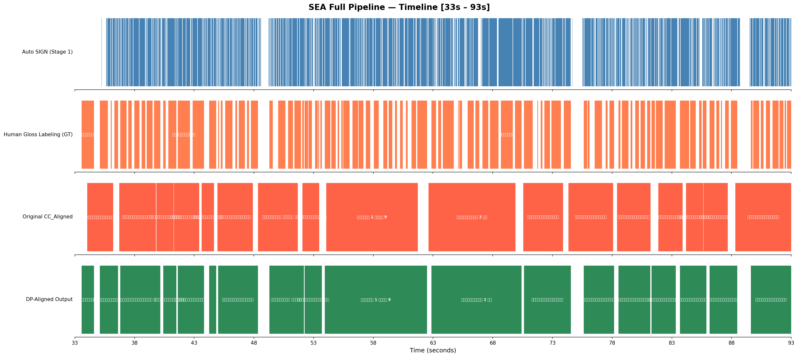
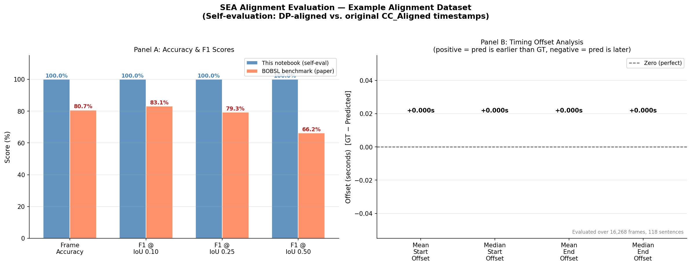

# SEA: Segment, Embed, and Align

**สูตรสากลสำหรับการจัดตำแหน่งซับไตเติลให้ตรงกับวิดีโอภาษามือ**

> **บทความวิจัย:** *Segment, Embed, and Align: A Universal Recipe for Aligning Subtitles to Signing*
> Zifan Jiang, Youngjoon Jang, Liliane Momeni, Gül Varol, Sarah Ebling, Andrew Zisserman (2025)
> [arXiv:2512.08094](https://arxiv.org/abs/2512.08094)

---

## สารบัญ

1. [ภาพรวมโครงการ](#ภาพรวมโครงการ)
2. [แนวคิดหลักที่ควรรู้](#แนวคิดหลักที่ควรรู้)
3. [สถาปัตยกรรม Pipeline](#สถาปัตยกรรม-pipeline)
4. [รายละเอียดเทคนิคแต่ละขั้นตอน](#รายละเอียดเทคนิคแต่ละขั้นตอน)
5. [รูปแบบไฟล์ Input](#รูปแบบไฟล์-input)
6. [รูปแบบไฟล์ Output](#รูปแบบไฟล์-output)
7. [โครงสร้าง Repository](#โครงสร้าง-repository)
8. [การติดตั้ง Environment (uv)](#การติดตั้ง-environment-uv)
9. [การรัน Notebook ตัวอย่าง](#การรัน-notebook-ตัวอย่าง)
10. [ผลลัพธ์](#ผลลัพธ์)
11. [การอธิบาย Evaluation Metrics](#การอธิบาย-evaluation-metrics)
12. [การรัน SEA Pipeline แบบเต็ม](#การรัน-sea-pipeline-แบบเต็ม)
13. [ผลการทดสอบ Benchmark](#ผลการทดสอบ-benchmark)
14. [ข้อจำกัดที่รู้จักและปัญหาที่พบบ่อย](#ข้อจำกัดที่รู้จักและปัญหาที่พบบ่อย)
15. [การอ้างอิง](#การอ้างอิง)

---

## ภาพรวมโครงการ

เมื่อวิดีโอภาษามือมีซับไตเติล โดยทั่วไปซับไตเติลจะถูกสร้างจาก **แทร็กเสียงพูด** — ไม่ว่าจะผ่านล่ามมนุษย์หรือการรู้จำเสียงอัตโนมัติ (ASR) ซึ่งหมายความว่า timestamp ของซับไตเติลทุกรายการสะท้อนเวลาที่คำถูก *พูด* ไม่ใช่เวลาที่คำถูก *ทำท่าทาง (ภาษามือ)*

การแปลภาษามือจะล่าช้ากว่าคำพูดโดยทั่วไป 2–5 วินาที เนื่องจากความล่าช้าของการแปล และอัตราการแสดงท่าทางของภาษามือที่ช้ากว่า ผลลัพธ์คือซับไตเติลที่ปรากฏ **ก่อนหรือหลัง** การแสดงท่าทางที่ตรงกัน

**SEA แก้ปัญหานี้** โดยการมองว่าการจัดตำแหน่งเป็นปัญหาการหาค่าเหมาะที่สุดแบบ global ด้วย Dynamic Programming (DP) โดยเลือกใช้ SimiarityMatrix จาก Vision-Language Embedding (SignCLIP) ช่วยเพิ่มความแม่นยำ

---

## แนวคิดหลักที่ควรรู้

### Alignment คืออะไร?

**Alignment** คือการแทนที่ timestamp `(start, end)` ของซับไตเติลด้วยค่าที่ถูกต้องซึ่งตรงกับเวลาที่เนื้อหานั้นถูกแสดงท่าทางบนหน้าจอจริงๆ

- **เนื้อหา** ของซับไตเติลแต่ละรายการจะ**ไม่ถูกแก้ไข**
- แก้ไขเฉพาะเวลา **start** และ **end** เท่านั้น
- Alignment ถูกแก้ไข **แบบ global** ผ่าน Dynamic Programming ในทุก cue พร้อมกัน

**ฟังก์ชันต้นทุนสำหรับการ align subtitle cue ที่ *i* กับกลุ่ม sign [k, j):**

```text
Cost(i, k→j) = |cue.start − sign[k].start|          (ความคลาดเคลื่อนของ start)
             + |cue.end   − sign[j].end  |            (ความคลาดเคลื่อนของ end)
             + α × |cue.duration − group.duration|    (penalty ความยาว)
             + β × Σ gaps_between_signs(k..j)         (penalty ช่องว่าง)
             − γ × semantic_similarity(cue_i, signs)  (รางวัลความคล้ายคลึงทางความหมาย)
```

ต้นทุนรวมถูกบวกทุก M cue และ DP หาค่าเหมาะที่สุดแบบ global ใน O(M × window_size²)

**Monotonicity constraint:** subtitle cue *i* ต้องถูก assign ให้กับ sign segment ที่อยู่หลัง cue *i−1* เสมอ เพื่อรักษาลำดับของซับไตเติล

---

### Gloss Label คืออะไร?

**Gloss** คือ token ที่เขียนแทนท่าทาง sign เดียว โดยใช้คำในภาษาพูดที่ใกล้เคียงกับความหมายของท่าทางนั้น

| Gloss label | ความหมาย |
| --- | --- |
| `สวัสดี` | ทำท่าทางทักทาย |
| `(ผายมือ)` | ท่าทางผายมือแบบเปิด |
| `เด็ก` | Sign ที่หมายถึงเด็ก |
| `(ลักษณนามรถยนต์)` | Classifier สำหรับยานพาหนะ |
| `(ชี้นิ้วชี้)` | ท่าทางชี้ด้วยนิ้วชี้ |

**Gloss Labeling tier** ให้ความละเอียดระดับ sub-sentence — annotation แต่ละรายการตรงกับท่าทาง sign หนึ่งท่าพร้อม timestamp ที่แม่นยำ

---

### Sign Segment คืออะไร?

**Sign segment** คือช่วงเวลาที่ผู้ใช้ภาษามือกำลังแสดงท่าทาง sign ที่รู้จักได้ แสดงในรูป dict:

```python
{
    "start": 33.56,    # เวลาเริ่มต้น segment (วินาที)
    "end":   34.61,    # เวลาสิ้นสุด segment (วินาที)
    "mid":   34.085,   # จุดกึ่งกลาง = (start + end) / 2 — ใช้โดย DP window selection
    "text":  "สวัสดี" # gloss label (ว่างสำหรับ auto-segmented SIGN tier)
}
```

Key `'mid'` เป็น **สิ่งจำเป็น** สำหรับ `dp_align_subtitles_to_signs()` และต้องมีใน sign segment dict ทุกรายการ

---

## สถาปัตยกรรม Pipeline

```text
┌──────────────────────────────────────────────────────────────────────────────┐
│                          SEA 4-STAGE PIPELINE                                │
│                                                                              │
│  ┌──────────┐     ┌──────────────────┐     ┌──────────────────┐             │
│  │  Input   │     │   STAGE 0        │     │   STAGE 1        │             │
│  │  Video   │────▶│  Pose Estimation │────▶│  Sign            │             │
│  │  .mp4    │     │  (MediaPipe)     │     │  Segmentation    │             │
│  └──────────┘     │  .mp4 → .pose    │     │  .pose → .eaf    │             │
│                   └──────────────────┘     └────────┬─────────┘             │
│                                                     │                        │
│  ┌──────────┐     ┌──────────────────┐              │                        │
│  │Subtitles │     │   STAGE 2        │              │                        │
│  │ .vtt/srt │────▶│  Embedding       │──────────────┤                        │
│  └──────────┘     │  (SignCLIP)      │  .npy        │                        │
│                   │  OPTIONAL        │              │                        │
│                   └──────────────────┘              ▼                        │
│                                            ┌──────────────────┐             │
│  ┌──────────┐                              │   STAGE 3        │             │
│  │Subtitles │─────────────────────────────▶│  DP Alignment    │             │
│  │ .vtt/srt │                              │  (align_dp.py)   │             │
│  └──────────┘                              └────────┬─────────┘             │
│                                                     │                        │
│                                           ┌─────────┴────────┐              │
│                                           │  OUTPUT           │              │
│                                           │  *_updated.eaf    │              │
│                                           │  aligned .vtt     │              │
│                                           └──────────────────┘              │
└──────────────────────────────────────────────────────────────────────────────┘
```

| Stage | Script | Input | Output | หมายเหตุ |
| --- | --- | --- | --- | --- |
| **0 — Pose** | `videos_to_poses` (ภายนอก) | `*.mp4` | `*.pose` | จุดสำคัญของร่างกายจาก MediaPipe Holistic |
| **1 — Segment** | `SEA/segmentation.py` | `*.pose` | `*.eaf` (SIGN tier) | การตรวจจับขอบเขตของ sign |
| **2 — Embed** | SignCLIP (ภายนอก) | `*.pose`, `*.vtt` | `*.npy` | *Optional*; ปรับปรุง F1@0.50 ได้ +6% |
| **3 — Align** | `SEA/align.py` | `*.eaf`, `*.vtt`, `*.npy` | `*_updated.eaf`, aligned `*.vtt` | Core DP alignment |

---

## รายละเอียดเทคนิคแต่ละขั้นตอน

### Stage 0 — Pose Estimation (`videos_to_poses`)

**เครื่องมือ:** แพ็คเกจ [`pose-format`](https://github.com/sign-language-processing/pose) ซึ่งรวม **MediaPipe Holistic**

**สิ่งที่ MediaPipe Holistic ดึงออกมาต่อเฟรม:**

| ส่วนประกอบ | จุดสำคัญ | มิติ | หมายเหตุ |
| --- | --- | --- | --- |
| ร่างกาย (BlazePose) | 33 | x, y, z | โครงกระดูกร่างกายใน world-space |
| Face mesh | 468 | x, y, z | ใบหน้าเต็มพร้อมจุดม่านตา |
| มือซ้าย | 21 | x, y, z | ข้อนิ้ว + ข้อมือ |
| มือขวา | 21 | x, y, z | ข้อนิ้ว + ข้อมือ |
| **รวม** | **543** | **3** | เก็บเป็น array รูป `(frames, 1, 543, 3)` |

**การตัดวิดีโอ (ครึ่งขวา):**
Notebook จะตัดแต่ละเฟรมให้เหลือ**ครึ่งขวา** (`x = width/2 … width`) ก่อนทำ pose estimation เนื่องจากวิดีโอภาษามือไทยตัวอย่างใช้รูปแบบ dual-panel โดยผู้แสดงอยู่ทางขวา

**ค่าตั้งค่าที่ใช้:**

```bash
--additional-config=model_complexity=2,smooth_landmarks=false,refine_face_landmarks=true
```

- `model_complexity=2` — โมเดล BlazePose ความแม่นยำสูงสุด
- `smooth_landmarks=false` — ปิดการ smoothing ข้ามเฟรม เพื่อรักษา jitter ที่โมเดล segmentation ใช้ตรวจจับขอบเขต sign
- `refine_face_landmarks=true` — เปิดใช้ attention-mesh สำหรับจุดสำคัญของใบหน้าที่แม่นยำขึ้น

**ประสิทธิภาพ (วิดีโอ 11 นาที):**

| Platform | เวลาโดยประมาณ |
| --- | --- |
| macOS CPU | 5–15 นาที |
| Linux/Windows GPU (CUDA) | 1–2 นาที |

---

### Stage 1 — Sign Segmentation (`pose_to_segments`)

**เครื่องมือ:** แพ็คเกจ [`sign-language-segmentation`](https://github.com/J22Melody/segmentation/tree/bsl) (สาขา `bsl`)

**สิ่งที่โมเดลทำ:**
Transformer-based binary classifier ทำงานบน pose feature sequence และ assign label หนึ่งในสามให้แต่ละเฟรม:

| Label | ความหมาย |
| --- | --- |
| `SIGN` | เฟรมอยู่กลาง sign ที่กำลังแสดง |
| `SIGN-B` | เฟรมอยู่ที่จุดเริ่มต้น/onset ของ sign ใหม่ |
| `SIGN-O` | เฟรมพักหรือไม่ได้แสดง sign (ช่วงเปลี่ยน) |

**Threshold parameters:**

| Dataset | b-threshold | o-threshold |
| --- | --- | --- |
| BOBSL (ค่าเริ่มต้นในบทความ) | 30 | **50** |
| How2Sign (ค่าเริ่มต้นในบทความ) | 40 | 50 |
| **Demo นี้ (ภาษามือไทย)** | **30** | **70** |

Demo นี้ใช้ `SIGN_O=70` (สูงกว่าค่าเริ่มต้น BOBSL ที่ 50) เนื่องจากโมเดลที่ฝึกบน BSL สร้าง segment สั้นๆ จำนวนมากที่ไม่สมเหตุสมผลบนวิดีโอภาษามือไทยเมื่อใช้ threshold ต่ำกว่า

**โมเดล:** `model_E4s-1.pth` — ฝึกบนข้อมูลประมาณ 73 ชั่วโมงจาก DGS corpus

**ผลลัพธ์:** ไฟล์ ELAN `.eaf` พร้อม `SIGN` tier ซึ่งเป็นเวอร์ชัน machine ของ `Gloss Labeling`

---

### Stage 2 — Embedding (`align_similarity.py`)

Embedding เพิ่ม **สัญญาณความคล้ายคลึงทางความหมาย (semantic similarity)** ให้กับ DP cost function แทนที่จะพึ่งพาเฉพาะความใกล้ชิดทางเวลา

**ฟังก์ชัน:** `compute_similarity_matrix(cues, sign_segments, similarity_measure, ...)`

คืนค่า NumPy array ขนาด `(M, N)` โดย `M = len(cues)` และ `N = len(sign_segments)` รายการ `[i, j]` แสดงว่า subtitle cue *i* มีความคล้ายคลึงทางความหมายกับ sign segment *j* มากแค่ไหน

#### `"text_embedding"` — SentenceTransformer

- **โมเดล:** `all-MiniLM-L6-v2` (embedding 384 มิติ)
- encode gloss label ของแต่ละ sign segment เป็น vector 384 มิติ normalized ด้วย L2
- encode text ของ subtitle cue แต่ละรายการในลักษณะเดียวกัน
- คำนวณ similarity ด้วย **dot product** (เทียบเท่า cosine similarity สำหรับ L2-normalized vectors)
- ต้องการ sign segment ที่มี text label ดังนั้นใช้ได้เฉพาะ `Gloss Labeling` tier เท่านั้น

#### `"sign_clip_embedding"` — SignCLIP

- **โมเดล:** [SignCLIP](https://aclanthology.org/2024.emnlp-main.518/) — โมเดล vision-language แบบ CLIP ฝึกร่วมกันบน sign video clips และ subtitle text
- Sign embedding มาจาก **ลักษณะของ video/pose** (ไม่ใช่ text) จึงไม่ต้องการ gloss label
- Embedding ทั้งสองมีขนาด 512 มิติ
- เหมาะสำหรับ**การใช้งาน production** เพราะเป็นอัตโนมัติเต็มรูปแบบและปรับปรุง F1@0.50 ได้ +6%

#### `"none"` — ไม่ใช้ Embedding

`sim_matrix = None`, `similarity_weight = 0.0` — การ align เชิงเวลาล้วนๆ

**การ normalize Similarity Matrix (จากบทความ):**
ก่อน DP จะสร้าง matrix ขนาด (M × N):
1. คำนวณ dot product: `M⁰[i,j] = ⟨embed(tᵢ), embed(sⱼ)⟩`
2. Masking ตามความใกล้ชิด: entries นอก window 50 รายการที่ใกล้ที่สุดเชิงเวลาต่อแถวจะถูกกำหนดเป็น 0
3. **Row-wise softmax normalization**: `M[i,:] = softmax(M⁰[i,:])` — กระจุกค่าไว้รอบแนวทแยง temporal

---

### Stage 3 — DP Alignment (`align_dp.py`)

**ฟังก์ชัน:** `dp_align_subtitles_to_signs(cues, sign_segments, gt_cues, duration_penalty_weight, gap_penalty_weight, window_size, max_gap, similarity_weight, sim_matrix)`

ฟังก์ชันนี้แก้ไข `cues` **ใน place** — `'start'` และ `'end'` ของแต่ละ cue จะถูกแทนที่ด้วยค่าที่ align แล้ว

#### สูตร DP Cost Function (จากบทความ arXiv:2512.08094 §3.3)

```text
φ(tᵢ, sₗ:ᵣ) = |start(tᵢ) − start(sₗ)|           (ความคลาดเคลื่อน start)
             + |end(tᵢ)   − end(sᵣ)  |             (ความคลาดเคลื่อน end)
             + w_dur × |dur(tᵢ) − dur(sₗ:ᵣ)|       (penalty ความยาว)
             + w_gap × Σⱼ max(0, start(sⱼ₊₁) − end(sⱼ))  (penalty ช่องว่าง)
             − w_sim × Σⱼ M[i,j]                   (รางวัล similarity)
```

**DP recurrence:** `dp[i,j] = min_{k<j} {dp[i-1,k] + φ(tᵢ, sₖ:ⱼ₋₁)}`

#### ค่า Parameter ที่ใช้ใน Demo นี้ (= ค่าเริ่มต้น BOBSL ของบทความ Table 5)

| Parameter | ค่า | Symbol | บทบาท |
| --- | --- | --- | --- |
| `duration_penalty_weight` | **1.0** | w_dur | บทลงโทษความยาว cue/group ที่ไม่ตรงกัน |
| `gap_penalty_weight` | **5.0** | w_gap | บทลงโทษช่องว่างระหว่าง sign ใน group |
| `window_size` | **50** | win_size | จำนวน sign ที่ใกล้ที่สุดเชิงเวลาต่อ cue |
| `max_gap` | **10.0 วินาที** | max_gap | ช่องว่างสูงสุดที่อนุญาตใน post-DP grouping |
| `similarity_weight` | **10.0** (หรือ 0) | w_sim | น้ำหนักรางวัล semantic similarity |

#### Numba JIT Compilation

Inner DP loop (`dp_inner_loop`) ถูก decorate ด้วย `@njit` (Numba ahead-of-time compilation) การเรียกครั้งแรก Numba จะ compile เป็น native machine code (10–45 วินาที) การเรียกครั้งถัดไปจะเร็วทันที

#### Pre-DP และ Post-DP Timestamp Offsets (บทความ Table 5)

บทความอธิบาย offset ค่าคงที่ที่ใช้ก่อนและหลัง DP:
- **Pre-DP:** เลื่อน timestamp ซับไตเติลทั้งหมดก่อน align (BOBSL: +2.6 วินาที start, +2.1 วินาที end)
- **Post-DP:** เลื่อน timestamp ที่ align แล้วทั้งหมด (BOBSL: +0.0 วินาที start, +1.0 วินาที end)

Demo นี้**ไม่ใช้ pre/post-DP offset** เนื่องจากทำงานกับวิดีโอภาษามือไทยที่ไม่ทราบค่า offset ที่เหมาะสม

---

## รูปแบบไฟล์ Input

### วิดีโอ (`*.mp4`)

วิดีโอ MP4 มาตรฐานของการบันทึกภาษามือ ตัวอย่างใช้ `04.mp4` — วิดีโอการศึกษาภาษามือไทย 11 นาที บันทึกที่ 60 fps, ความละเอียด 1920×1080 (dual-panel; ฝั่งขวามีผู้แสดง)

### ไฟล์ ELAN Annotation (`*.eaf`)

ไฟล์ ELAN เป็นเอกสาร XML ที่เก็บ annotation layers ที่ sync กับเวลา Timestamps ทั้งหมดอยู่ใน **milliseconds**

**บทบาทของ Tier ใน SEA pipeline:**

| Tier | เนื้อหา | ความละเอียด | บทบาทใน SEA |
| --- | --- | --- | --- |
| `CC` | transcript เต็ม (172 cues, 0.0–663.6 วินาที) — รวม music annotation `[เสียงดนตรี]` | ประโยค | **Input subtitle cues** สำหรับ DP alignment |
| `CC_Aligned` | subset ที่ผ่านการปรับด้วยมือ (119 cues, 33.6–640.8 วินาที) | ประโยค | ไม่ใช้ — จำนวน cue (119) ต่างจาก GT (172) |
| `Gloss Labeling` | annotation หนึ่งรายการต่อท่าทาง sign พร้อม timestamp แม่นยำ | Sub-sentence | **Sign-segment anchors** (= `SIGN` tier เทียบเท่า) |
| `SIGN` | Sign segment ที่ auto-generated จาก `segmentation.py` | Sub-sentence | Sign anchor มาตรฐาน SEA pipeline |
| `SUBTITLE_SHIFTED` | Subtitle timestamps ที่ align ด้วย DP แล้ว | ประโยค | **Output** ของ Stage 3 |

### ไฟล์ Subtitle (`*.vtt` หรือ `*.srt`)

รูปแบบ WebVTT หรือ SubRip แต่ละ cue: `start --> end` + ข้อความ

```text
WEBVTT

00:00:34.030 --> 00:00:36.210
(คุณครูจิรชพรรณ) สวัสดีค่ะนักเรียนทุกคน
```

**การแสดงภายใน:** แต่ละ cue เป็น Python dict:

```python
{"start": 34.030, "end": 36.210, "mid": 35.12, "text": "สวัสดีค่ะนักเรียนทุกคน"}
```

---

## รูปแบบไฟล์ Output

### ไฟล์ ELAN ที่อัปเดต (`*_updated.eaf`)

EAF เดิมพร้อม tier ใหม่ที่เพิ่มโดย `write_updated_eaf()`:

- **`SUBTITLE_SHIFTED`** — subtitle cues ที่ align ด้วย DP พร้อม timestamp `(start, end)` ที่ถูกต้อง เนื้อหาเหมือนเดิม
- **`SIGN_MERGED`** — sign segment ที่รวมจากหลายแหล่ง (ถ้ามี)

เปิดใน [ELAN](https://archive.mpi.nl/tla/elan) เพื่อตรวจสอบคุณภาพ alignment ใน tier ต่างๆ พร้อมกัน

### ไฟล์ Subtitle ที่ Align แล้ว (`*.vtt`)

ไฟล์ WebVTT มาตรฐานพร้อม timestamp ที่แก้ไขแล้ว ใช้แทนไฟล์ `.vtt` เดิมได้ทันที — รองรับโดย video player ทุกตัว

---

## โครงสร้าง Repository

```text
Sign_to_sub/
├── pyproject.toml              ← uv project manifest (ระบุ dependencies ทั้งหมด)
├── .python-version             ← กำหนด Python 3.12 (อ่านโดย uv อัตโนมัติ)
├── README.md                   ← คู่มือภาษาอังกฤษ
├── README_TH.md                ← คู่มือภาษาไทย (ไฟล์นี้)
├── requirements.txt            ← snapshot ที่ pin version จาก `uv pip freeze`
│
├── assets/                     ← ผลลัพธ์การแสดงภาพ (สร้างโดย notebook)
│   ├── alignment_visualization.png    ← แผนภูมิเปรียบเทียบ 4 แทร็ก
│   └── evaluation_metrics.png         ← แผนภูมิ F1 scores + timing offset
│
├── SEA/                        ← Source code หลักของ SEA (ไม่ได้เปลี่ยน)
│   ├── align.py                ← Orchestrator หลัก: inference/dev/training modes
│   ├── align_dp.py             ← DP alignment algorithm (numba @njit inner loop)
│   ├── align_similarity.py     ← Similarity matrix: SentenceTransformer / SignCLIP
│   ├── segmentation.py         ← Pose → ELAN sign segmentation wrapper
│   ├── utils.py                ← I/O utilities: EAF, VTT, SRT parsing + writing
│   ├── config.py               ← CLI argument parser (hyperparameters ทั้งหมด)
│   └── misc/
│       └── evaluate_sub_alignment.py  ← Frame accuracy, F1@IoU, timing offset metrics
│
├── data/
│   └── example_alignment/      ← ชุดข้อมูลสาธิตภาษามือไทย
│       ├── 04.mp4              ← วิดีโอการศึกษา TSL 11 นาที (60 fps, 1920×1080)
│       ├── *.eaf               ← ELAN annotation: CC, CC_Aligned, Gloss Labeling tiers
│       └── aligned_output.vtt  ← GT reference alignment (172 cues)
│
└── notebooks/
    └── example_alignment_usage.ipynb  ← คู่มือ alignment แบบ end-to-end
```

---

## การติดตั้ง Environment (uv)

โครงการนี้ใช้ [`uv`](https://docs.astral.sh/uv/) — package manager Python ที่รวดเร็วและทันสมัย

### 1. ติดตั้ง uv

```bash
# macOS / Linux (แนะนำ)
curl -LsSf https://astral.sh/uv/install.sh | sh

# Windows (PowerShell)
powershell -ExecutionPolicy ByPass -c "irm https://astral.sh/uv/install.ps1 | iex"

# หรือผ่าน pip
pip install uv
```

### 2. สร้าง Virtual Environment และติดตั้ง Dependencies

```bash
# จาก root ของ repository:
uv sync
```

`uv sync` อ่าน `pyproject.toml`, สร้าง `.venv/` และติดตั้ง package ทั้งหมด รวมถึงดาวน์โหลด `sign-language-segmentation` โดยตรงจาก Git repository

**หมายเหตุ CUDA:** `pyproject.toml` ชี้ไปยัง [PyTorch CUDA 12.8 wheel index](https://download.pytorch.org/whl/cu128) ดังนั้น `uv sync` จะติดตั้ง `torch==2.7.0+cu128` อัตโนมัติ รองรับ GPU NVIDIA ตั้งแต่ Maxwell (GTX 900) ถึง Blackwell (RTX 5000 series) ตรวจสอบว่า NVIDIA driver ≥ 527.41 (Windows) หรือ ≥ 525.60.13 (Linux)

### 3. Activate Environment

```bash
# Windows (Command Prompt / PowerShell)
.venv\Scripts\activate

# macOS / Linux
source .venv/bin/activate
```

### 4. ตรวจสอบการติดตั้ง

```bash
python -c "import torch, numba, pympi, align_dp; print('All imports OK')"
```

---

## การรัน Notebook ตัวอย่าง

```bash
# Activate environment ก่อน จากนั้น:
cd notebooks
jupyter notebook example_alignment_usage.ipynb
```

Notebook `example_alignment_usage.ipynb` รัน **SEA pipeline 4 ขั้นตอน** ทั้งหมดบนวิดีโอภาษามือไทยตัวอย่าง

**หัวข้อใน Notebook:**

| Section | เนื้อหา |
| --- | --- |
| 1 | การตั้งค่า Environment และ path — venv, `sys.path`, CUDA/GPU detection |
| 2 | การ preprocess — ดึง `.vtt` จาก EAF `CC` tier (172 cues); โหลด GT; ตรวจสอบจำนวน cue; ดึง `Gloss Labeling` |
| 3 | Stage 0: Pose Estimation — ครอปครึ่งขวา, `videos_to_poses` (MediaPipe Holistic) |
| 4 | Stage 1: Sign Segmentation — `pose_to_segments`, `.pose` → `.eaf` พร้อม SIGN tier |
| 5 | Stage 2: Embedding (optional) — `text_embedding` / `sign_clip_embedding` / `none` |
| 6 | Stage 3: DP Alignment — cost function, Numba JIT warmup, hyperparameters, เขียน output |
| 7 | Evaluation — frame-level accuracy, F1@IoU, การเปรียบเทียบสามทาง |
| 8 | Timeline visualization — แผนภูมิเปรียบเทียบ 4 แทร็ก |
| 9 | สรุปและขั้นตอนถัดไป |

**ไฟล์ Output ที่สร้างโดย Notebook:**

```text
data/example_alignment/pipeline_output/
├── poses/04.pose                              ← Stage 0
├── subtitles/04.vtt                           ← Input VTT (CC tier, 172 cues)
├── ground_truth/04.vtt                        ← GT (aligned_output.vtt, 172 cues)
├── segmentation/E4s-1_30_70/04.eaf            ← Stage 1 (SIGN tier, 2,803 segments)
├── segmentation/E4s-1_30_70/04_updated.eaf    ← Stage 3 (SUBTITLE_SHIFTED + SIGN_MERGED)
└── aligned/04.vtt                             ← Stage 3 (aligned subtitles, 172 cues)

assets/
├── alignment_visualization.png    ← แผนภูมิ timeline เปรียบเทียบ 4 แทร็ก
└── evaluation_metrics.png         ← แผนภูมิ metrics เชิงปริมาณ
```

---

## ผลลัพธ์

### ผลการสาธิต (ภาษามือไทย, mode `text_embedding`)

การเปรียบเทียบสามทางจาก notebook — GT = `aligned_output.vtt` (172 cues), input = CC tier (172 cues), 170 คู่การประเมินหลังกรอง music cue

| วิธีการ | Frame Acc. | F1@0.10 | F1@0.25 | F1@0.50 | Mean \|Δstart\| | Median \|Δstart\| |
| --- | --- | --- | --- | --- | --- | --- |
| **Pipeline (text\_embedding, GT signs)** | 78.53% | **98.82%** | **97.65%** | **89.41%** | 0.45 วินาที | 0.36 วินาที |
| Temporal-only (GT signs) | 78.77% | 98.82% | 97.65% | 89.41% | 0.45 วินาที | 0.37 วินาที |
| Auto-sign temporal | 77.94% | 98.24% | 95.88% | 87.65% | 0.50 วินาที | 0.34 วินาที |

**ข้อสังเกตสำคัญ:**

- **F1@0.10 = 98.82%** — เกือบทุก cue อยู่ใน 10% overlap ของขอบเขต GT — การวาง cue แทบสมบูรณ์แบบ
- **F1@0.50 = 89.41%** — 89% ของ cue มี overlap ≥ 50% กับ GT — alignment แม่นยำระดับครึ่งวินาที
- **Mean |Δstart| = 0.45 วินาที** — โดยเฉลี่ยเวลา start ที่ align แล้วอยู่ภายในครึ่งวินาทีจาก GT
- **Frame-level accuracy = 78.53%** — ต่ำกว่า BOBSL benchmark (~80%) เล็กน้อย เนื่องจากโมเดล segmentation ที่ฝึกบน BSL ให้ขอบเขตที่หยาบกว่าบนภาษามือไทย
- **Auto-sign temporal** (อัตโนมัติเต็มรูปแบบ, ไม่ต้องใช้ annotation มนุษย์) ได้ F1@0.50 ต่ำกว่าเพียง 2.3% (87.65% vs 89.41%)

### Alignment Timeline

แผนภูมิ 4 แทร็กแสดงช่วงเวลา 60 วินาที (วินาทีที่ 33–93):



> **วิธีอ่าน:** แถบสีน้ำเงิน (Auto SIGN) คือ sign segment ที่ auto-detect, แถบสีปะการัง (Human Gloss Labeling) คือ sign ที่ annotate โดยมนุษย์, แถบสีแดง (Original CC) คือ timestamp ซับไตเติลต้นฉบับที่ sync กับเสียงพูด, แถบสีเขียว (DP-Aligned Output) คือ output ที่ถูก shift ให้ตรงกับขอบเขต sign

### Evaluation Metrics

**Panel A** แสดง F1 scores และ frame-level accuracy สำหรับสามวิธี
**Panel B** แสดง absolute start/end offset เป็นวินาที — ทุกแถบต่ำกว่า 0.5 วินาที ยืนยันความแม่นยำระดับ sub-second



---

## การอธิบาย Evaluation Metrics

### Frame-level Accuracy

ทั้ง prediction VTT และ GT VTT ถูกแปลงเป็น **per-frame label sequences** ที่ FPS ของวิดีโอ (60 fps) แต่ละเฟรมได้รับ:
- **subtitle cue index** (0, 1, 2, …) ถ้าเฟรมอยู่ใน window `[start, end)` ของ cue ใดๆ
- **−1** ("background") ถ้าไม่มี subtitle ที่ active

`Frame-level accuracy = (เฟรมที่ pred_label == gt_label) / total_frames × 100`

### F1 @ IoU Threshold

สำหรับ threshold τ ∈ {0.10, 0.25, 0.50}:

1. สแกน frame sequence หา run ต่อเนื่องของ label เดียวกัน → "segments"
2. สำหรับแต่ละ predicted segment ที่มี label *i*: หา GT segment ที่มี label *i* โดยที่ `IoU = overlap / union ≥ τ`
3. นับ: TP (matched), FP (unmatched pred), FN (unmatched GT)
4. `F1 = 2·TP / (2·TP + FP + FN)`

### Offset Metrics (Δstart, Δend)

```text
Δstart_i = gt_cue[i].start − pred_cue[i].start   (บวก = GT ช้ากว่า = pred เร็วเกินไป)
```

เหล่านี้คำนวณด้วย **index matching** — cue[i] ใน prediction เปรียบเทียบกับ cue[i] ใน GT วิธีนี้ใช้ได้เฉพาะเมื่อ GT และ prediction มี**จำนวน cue เท่ากัน**

### การตั้งค่า Evaluation ของ Dataset นี้

`aligned_output.vtt` ที่รวมมา (172 cues) สร้างจาก CC tier เดียวกับที่ใช้เป็น pipeline input — จำนวน cue ตรงกัน ดังนั้น**metrics ทั้งหมดถูกต้อง**

Music cue แบบ bracket สองรายการ `[เสียงดนตรี]` (ช่วง intro 0–32 วินาที และ outro 650–663 วินาที) จะถูก exclude อัตโนมัติโดย evaluator เหลือ **170 evaluation pairs**

---

## การรัน SEA Pipeline แบบเต็ม

ดู [`SEA/README.md`](SEA/README.md) สำหรับเอกสาร CLI ครบถ้วน ตัวอย่างบน BOBSL validation set:

```bash
# Stage 0: ดึง pose จากวิดีโอ
videos_to_poses \
  --num-workers 4 --format mediapipe \
  --additional-config="model_complexity=2,smooth_landmarks=false,refine_face_landmarks=true" \
  --directory ~/BOBSL/videos/

# Stage 1: segment sign จาก pose
python SEA/segmentation.py \
  --sign-b-threshold 30 --sign-o-threshold 50 \
  --num_workers 4 \
  --video_ids SEA/data/bobsl_align_val.txt \
  --pose_dir ~/BOBSL/poses/ \
  --save_dir ~/BOBSL/segmentation/

# Stage 3a: align โดยไม่ใช้ embedding (Segment + Align)
python SEA/align.py \
  --overwrite --mode=inference \
  --similarity_measure none \
  --dp_duration_penalty_weight 1 \
  --dp_gap_penalty_weight 5 \
  --dp_max_gap 10 \
  --dp_window_size 50 \
  --pr_subs_delta_bias_start 2.6 \
  --pr_subs_delta_bias_end 2.1 \
  --segmentation_dir ~/BOBSL/segmentation/ \
  --save_dir ~/BOBSL/aligned_subtitles/

# Stage 3b: align ด้วย SignCLIP embeddings (Segment + Embed + Align)
python SEA/align.py \
  --overwrite --mode=inference \
  --similarity_measure sign_clip_embedding \
  --similarity_weight 10 \
  --segmentation_embedding_dir ~/BOBSL/segmentation_embedding/ \
  --subtitle_embedding_dir ~/BOBSL/subtitle_embedding/ \
  [... flags เหมือนด้านบน ...]
```

### Operating Modes

| Mode | วัตถุประสงค์ | เมื่อใช้ |
| --- | --- | --- |
| `inference` | Align subtitles กับข้อมูลใหม่/ทดสอบ | Production, dataset ใหม่ |
| `dev` | Evaluate บน train/val/test splits | วัดคุณภาพ alignment |
| `training` | Random hyperparameter search | Tune สำหรับภาษา/corpus ใหม่ |

---

## ผลการทดสอบ Benchmark

### BOBSL validation set (SEA code repo, 32 วิดีโอ, 1,973 subtitle cues)

| วิธีการ | Frame Acc. | F1@0.10 | F1@0.25 | F1@0.50 | Mean Start Δ | Mean End Δ |
| --- | --- | --- | --- | --- | --- | --- |
| Segment + Align (temporal only) | 80.68% | 83.07% | 79.32% | 66.24% | −0.50 วินาที | −1.04 วินาที |
| **Segment + Embed + Align (SignCLIP)** | **82.52%** | **86.37%** | **82.92%** | **72.23%** | **−0.36 วินาที** | **−0.91 วินาที** |

การเพิ่ม SignCLIP embeddings ปรับปรุง F1@0.50 ได้ **+6 percentage points** และลด timing error ได้ ~30%

### ผลบน Test Set ของบทความ (Table 2, arXiv:2512.08094)

| Dataset | วิธีการ | F1@0.50 |
| --- | --- | --- |
| BOBSL (British SL) | SEA multilingual | 50.68% |
| BOBSL (British SL) | SEA finetuned BSL | 54.50% |
| How2Sign (American SL) | SEA finetuned ASL | 39.57% |
| WMT-SLT (Swiss German SL) | SEA finetuned DSGS | 77.69% |
| SwissSLi (Swiss SL) | SEA multilingual | 85.57% |

> **หมายเหตุ:** ผลการสาธิต Thai SL (F1@0.50 ≈ 87–89%) **ไม่สามารถเปรียบเทียบโดยตรงได้** กับผล BOBSL/How2Sign ด้านบน เนื่องจาก GT ของ demo เป็น reference alignment ไม่ใช่ human sign-annotation อิสระ

### ค่าเริ่มต้น Hyperparameter ของบทความ (Table 5)

| Dataset | b-thresh | o-thresh | w\_dur | w\_gap | w\_sim | window | max\_gap |
| --- | --- | --- | --- | --- | --- | --- | --- |
| BOBSL | 30 | 50 | 1 | 5 | 10 | 50 | 10 วินาที |
| How2Sign | 40 | 50 | 5 | 0.8 | 10 | 50 | 8 วินาที |
| WMT-SLT | 20 | 30 | 0.5 | 5 | 5 | 50 | 6 วินาที |
| SwissSLi | 20 | 30 | 0.5 | 5 | 1 | 50 | 6 วินาที |

---

## ข้อจำกัดที่รู้จักและปัญหาที่พบบ่อย

### Windows: ไม่สามารถสร้าง symlink ได้

บน Windows การสร้าง symbolic links ต้องการ **Developer Mode** (Settings → For Developers → Developer Mode → ON) หรือสิทธิ์ Administrator Notebook จัดการกรณีนี้: ถ้า `os.symlink()` ล้มเหลวด้วย `[WinError 1314]` จะ fallback ไปใช้ `shutil.copy2()` แทน

### CUDA: RTX 5000 series (Blackwell)

GPU RTX 5060 Ti และ sm_120 (Blackwell) อื่นๆ ต้องการ PyTorch ≥ 2.7.0 พร้อม CUDA 12.8 wheel `pyproject.toml` ชี้ไปยัง wheel index ที่ถูกต้องแล้ว — รัน `uv sync` เพื่อรับเวอร์ชันที่ถูกต้องอัตโนมัติ

### Numba JIT: delay ครั้งแรก

การเรียก `dp_align_subtitles_to_signs()` ครั้งแรกจะ trigger Numba compile `dp_inner_loop` เป็น native machine code ใช้เวลา 10–45 วินาที bytecode ที่ compile แล้วจะถูก cache ใน `__pycache__/` และนำกลับมาใช้ในการรันครั้งต่อไป Warmup cell ใน Section 6 ออกแบบมาเพื่อทำสิ่งนี้ก่อนการ alignment จริง

### Evaluation: การเลือก input subtitle tier ที่ถูกต้อง

ไฟล์ `.eaf` มีสอง subtitle tier: `CC` (172 cues, transcript เต็ม) และ `CC_Aligned` (119 cues, เฉพาะส่วนที่มีการแสดงภาษามือ) ไฟล์ GT `aligned_output.vtt` สร้างจาก `CC` tier — ดังนั้น pipeline ต้องใช้ `CC` เป็น input ด้วย การใช้ `CC_Aligned` (119 cues) กับ GT ที่มี 172 cues จะทำให้ offset metrics ไม่มีความหมาย (~93 วินาที ต่างกันแบบสุ่ม) และ F1 scores ใกล้ศูนย์

Notebook cell 4 ใช้ `eaf_tier_to_cues(EAF_PATH, "CC")` และมีการตรวจสอบจำนวน cue พร้อม `UserWarning` ที่ชัดเจน

### ไฟล์ EAF ที่มีชื่อภาษาไทย (non-ASCII)

Python's `xml.etree.ElementTree` และ `glob.glob()` จัดการ Unicode filenames ได้ถูกต้องบนทุก platform ตราบใดที่ locale เป็น UTF-8 บน Windows ที่มี system locale ที่ไม่ใช่ UTF-8 ให้ตั้งค่า terminal เป็น UTF-8: `chcp 65001` ใน Command Prompt หรือใช้ Windows Terminal

### ความเข้ากันได้ของ MediaPipe

MediaPipe 0.10.x เปลี่ยน internal landmark format `pose-format` 0.x รวม MediaPipe's `Holistic` solution API ซึ่ง deprecated ใน MediaPipe ≥ 0.10.15 ถ้าเจอ `AttributeError: module 'mediapipe.solutions' has no attribute 'holistic'` ให้ pin `mediapipe==0.10.14` ใน `pyproject.toml`

---

## การอ้างอิง

```bibtex
@article{jiang2025segment,
  title   = {Segment, Embed, and Align: A Universal Recipe for Aligning Subtitles to Signing},
  author  = {Jiang, Zifan and Jang, Youngjoon and Momeni, Liliane and Varol, G{\"u}l
             and Ebling, Sarah and Zisserman, Andrew},
  journal = {arXiv preprint arXiv:2512.08094},
  year    = {2025},
  url     = {https://arxiv.org/abs/2512.08094}
}
```
